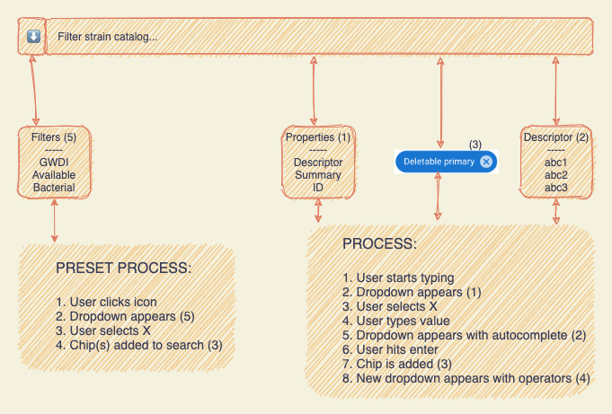

# catalog-search

  
  

This is a demo for the new stock catalog search feature.

[Global State](./docs/global-state.md) - documentation about all state stored in the global catalog context

## Misc badges

  

  

  

